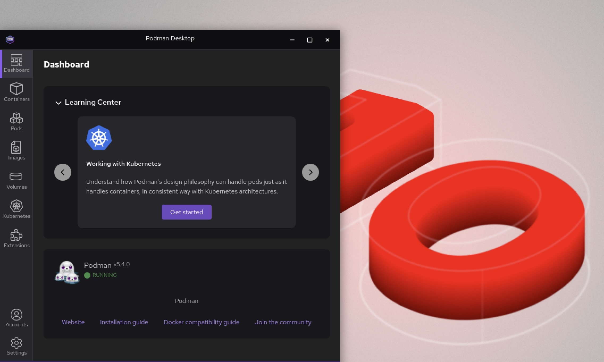

# Simplifying container and AI development on RHEL 10

In the ever-evolving world of containerization and AI, developers require tools that are designed for seamless integration into their daily workflows. Podman and its graphical tool, Podman Desktop, have emerged as promising tools for building applications on different platforms, including Red Hat Enterprise Linux (RHEL) 10.

## Podman: The foundation

Podman offers an efficient way to interact with containers and Kubernetes. It is fast and light-weight and operates with a daemonless architecture. Podman supports rootless containers, allowing you to restrict privileges without compromising functionality. Developers can pull, build, and push images, run and debug containers, and efficiently work with Kubernetes. Podman integrates smoothly with systemd, offering basic container orchestration capabilities like pod management and Quadlet systemd generation.

## Podman Desktop: A crucial component for developers on RHEL

Podman Desktop significantly enhances the Podman experience by providing a user-friendly interface that simplifies container and Kubernetes management. It provides a streamlined experience for building, running, and managing containers and pods. It also offers robust Kubernetes integration, enabling you to create local clusters with tools like Kind and Minikube.
Podman Desktop simplifies the local development environment by tackling challenges like complexity, skill gaps, and inconsistencies between local and production deployments. It provides a simple onboarding process, guiding developers to move from individual applications to containers, pods, and finally to Kubernetes.

Podman Desktop provides the [Docker compatibility](/docs/migrating-from-docker) feature to support Dockerfiles and Compose, which minimizes the need for configuration changes. It allows for easy migration from Docker to Podman and even lets you run `docker` commands that Podman interprets.
Podman is included with a RHEL subscription. When you install Podman Desktop from the RHEL extensions repository, Podman Desktop detects Podman and runs it to provide a simplified integration between these two tools. For developers building applications on RHEL, the integration is beneficial in providing:

- Standardized container environment: Use a consistent set of tools and practices, simplifying management and deployment of containers in production.
- Cross-platform consistency: Enjoy a familiar experience across Windows, macOS, and RHEL.
- Support for several RHEL extensions: A variety of extensions available within Podman Desktop to enhance RHEL developer workflows with key functionalities:
  - [Bootable Container](https://github.com/podman-desktop/extension-bootc): Create bootable container images for bare metal, AWS, and other environments. For more details, refer to this [learning path](https://developers.redhat.com/learn/rhel/build-and-run-bootable-container-image-image-mode-rhel-and-podman-desktop).
  - [RHEL VMs](https://github.com/redhat-developer/podman-desktop-rhel-ext): Easily run and manage RHEL VMs from a macOS or Windows environment.
  - [RHEL Lightspeed](https://github.com/redhat-developer/podman-desktop-redhat-lightspeed-ext): An AI assistant that simplifies Linux administration and management. It enables interaction with RHEL using plain language and provides recommendations for troubleshooting and tuning.
  - [Red Hat Authentication](https://github.com/redhat-developer/podman-desktop-redhat-account-ext): Streamline authentication to Red Hat, access the Red Hat container registry, and register Linux VMs, often through a no-cost Red Hat developer subscription.

## Podman AI Lab: Simplifying the AI developer workflow on RHEL

The Podman AI Lab extension is helpful for AI developers working within the RHEL ecosystem. It empowers you to run Large Language Models (LLMs) locally, simplifying the development and debugging of AI-enabled applications directly on your machine. This approach offers several benefits, including data privacy, cost control, and the ability to test and debug applications in a local environment. The extension simplifies the AI application development workflow by providing:

- A curated catalog of open-source models available for downloading.
- A playground environment for experimenting with models and customizing prompts.
- A recipe catalog with sample AI use cases.
- An integration with LlamaStack from your local environment, run containerized distributions, and access LlamaStack APIs.
- Code snippets for various languages and frameworks, simplifying the infusion of AI into your applications.
- An inference server to serve models locally with an OpenAI-compatible API.

This enables developers to easily get started with generative AI and integrate models into their applications.

## Availability and installation on RHEL 10

With Podman Desktop availability in the RHEL extensions repository channel, you can easily download and use it. This repository is a curated collection of modern developer tools, open-source libraries, and specialized utilities, ensuring reliable, up-to-date, and Red Hat-signed software.
For installation, you need a RHEL 10 machine that is registered with the subscription manager using either your [account details](https://docs.redhat.com/en/documentation/subscription_central/1-latest/html/getting_started_with_rhel_system_registration/basic-reg-rhel-cli#proc-reg-rhel-rhc-username_) or an [activation key](https://docs.redhat.com/en/documentation/subscription_central/1-latest/html/getting_started_with_rhel_system_registration/basic-reg-rhel-cli#proc-reg-rhel-rhc-act-key_).

The installation and verification procedure includes:

1. Open a terminal, and enable the RHEL extensions repository:

   ```sh
   $ sudo subscription-manager repos --enable rhel-10-for-$(arch)-extensions-rpms
   ```

1. Enter your password when prompted.
1. Install Podman Desktop:
   ```sh
   $ sudo dnf install podman-desktop
   ```
1. Enter `y` to confirm the installed size.
1. Enter `y` to import the GPG key and complete the installation.
1. Enter Podman Desktop in the search box at the top of your home screen, and click the application to open it.
1. Follow the prompts to complete a quick onboarding process with the application.
   
1. Run basic tasks, such as:
   - [Start a container](/docs/containers/starting-a-container)
   - [Create a Kubernetes cluster](/docs/kubernetes/creating-a-kube-cluster)

### Important note on support

Podman Desktop is an open-source community project. While Podman itself has supported options on RHEL, the support model for Podman Desktop for Red Hat customers falls under [_Cooperative Community Support_](https://source.redhat.com/groups/public/cooperative_community_support). This means it is intended for non-production support and only offers benefits from community contributions, though with no or limited Service Level Agreements (SLAs). Entitled customers can use this level of support to raise non-production queries and open tickets for more complex issues.

## Get involved: Your feedback matters!

Podman Desktop is an evolving project, and your feedback is crucial for its continued development and improvement. We encourage you to:

- Provide feedback: Share your experiences and suggestions for shaping the future of the project. Use the Share your feedback icon in the taskbar to give quick feedback.
- Create issues: If you encounter a bug or have a feature request, please create an issue on the [GitHub repository](https://github.com/podman-desktop/podman-desktop/issues).
- Join the community: Engage with fellow developers and maintainers, ask questions, and share your knowledge. You can find us on [GitHub](https://github.com/podman-desktop/podman-desktop) and contribute to [community discussions](https://podman-desktop.io/community).

For more information, visit [Podman](https://podman.io) and [Podman Desktop](https://podman-desktop.io/). Dive in, explore, and help us continue to build a robust and user-friendly experience for container and AI development on RHEL 10!
