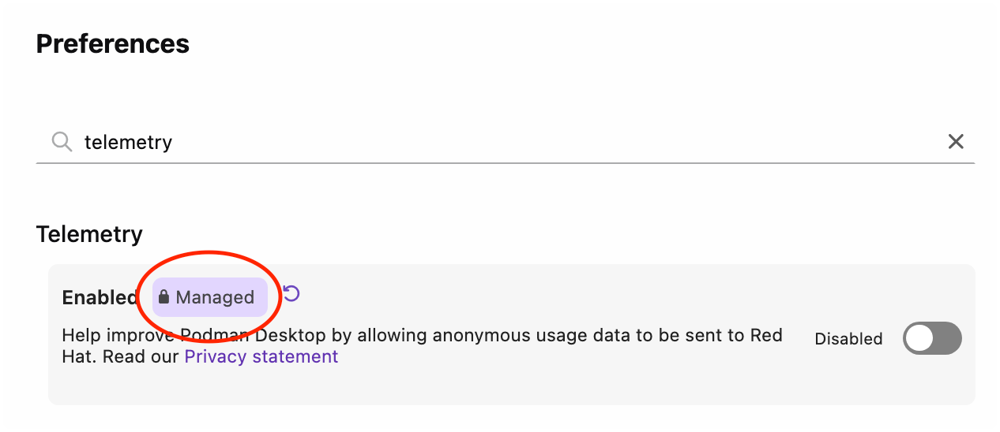

# Troubleshooting managed configuration

When implementing managed configuration in an enterprise environment, you may encounter some common issues often caused by file location, permissions, or syntax errors.

## Locked configuration not working

If your locked configuration is not being applied, try the following solutions:

1. Verify file locations are correct for your operating system.
2. Check file permissions (files must be owned by root/administrator).
3. Ensure JSON syntax is valid (use a JSON validator).
4. Restart Podman Desktop after creating configuration files.

## Settings not being enforced

If settings appear to be locked but values are not being enforced correctly:

1. Check that the key name in `locked.json` exactly matches the key in `default-settings.json`.
2. Verify the configuration key uses dot notation (e.g., `proxy.http`, not `proxy: { http: ... }`).
3. Check console output for error messages.

## Verifying configuration is loaded

To verify that your managed configuration is being loaded correctly:

1. Open Podman Desktop.
2. Go to **Help > Troubleshooting**, and select the **Logs** tab to check for messages such as:
3. Look for messages in the console like:
   ```
   [Managed-by]: Loaded managed ...
   [Managed-by]: Applied default settings for: setting.key1, setting.key2
   ```
4. If you don't see these messages, the configuration files may not be in the correct location or may have syntax errors.

:::note

The "Applied default settings" message only appears when settings are copied from `default-settings.json` to the user's `settings.json`. This occurs once per setting when it doesn't already exist in the user's configuration.

:::

## Verifying if a value is locked by the managed-by configuration

To verify in the GUI if a value is locked by your managed-by configuration:

1. Open Podman Desktop.
2. Go to **Settings > Preferences**.
3. Find your managed-by value:



4. Confirm that it has the **Managed** label applied.

## File permission issues

On Linux and macOS, managed configuration files must have appropriate permissions:

- Files must be owned by root/administrator
- Files should be readable by all users but writable only by root/administrator
- Use `chmod 644` for the configuration files on Linux/macOS

## Additional resources

- [Configuring a managed user environment](/docs/configuration/managed-configuration)
- [Managed configuration use cases](/docs/configuration/managed-configuration-use-cases)
- [Configuration settings reference](/docs/configuration/settings-reference)
