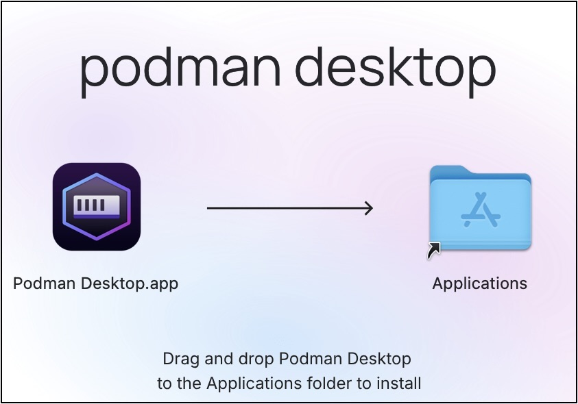
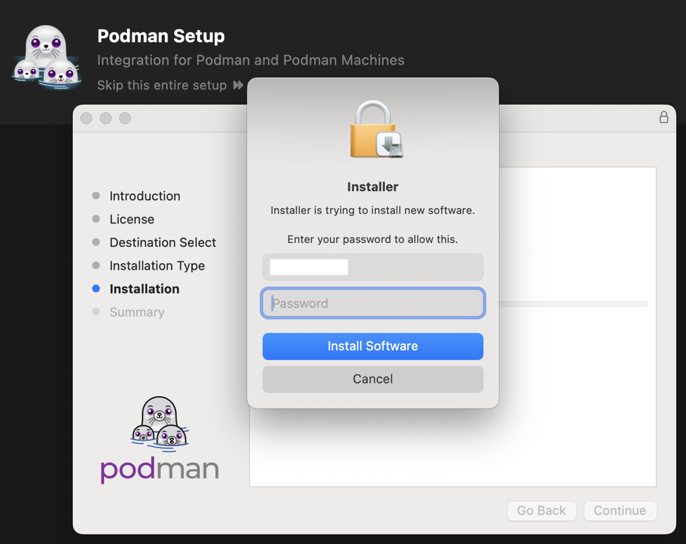
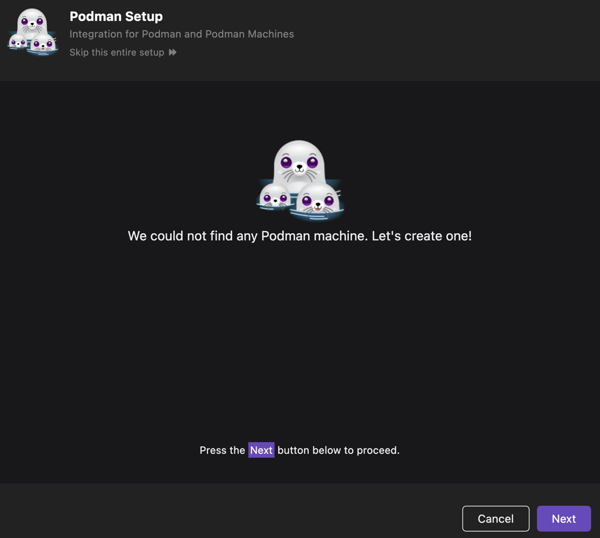

# MacOS

:::info[Prerequisite]
Podman Desktop requires the [Podman engine](https://docs.podman.io/en/latest/index.html). If you do not have the Podman engine installed, Podman Desktop will prompt you to do so when you open it.
:::

You can install Podman Desktop on macOS by using:

- The .dmg installer file: This is the recommended way to install Podman Desktop, Podman, and Podman CLI smoothly. The `.dmg` installer provides the most stable experience by bundling the required components. This avoids the path conflicts and stability issues common with package managers like Homebrew.
- Homebrew: This is an alternative way, but it is not recommended, as there is no guarantee of the stability of Brew installs of Podman and Podman Desktop.

  :::note

  If you have already installed Podman using Homebrew, perform one of the following steps to avoid any unexpected results when using Podman Desktop:
  - Uninstall Podman through Homebrew before using the recommended .dmg installer.
  - Do not use the .dmg installer to install Podman Desktop. Instead, use Homebrew only.

  :::

## Installing Podman Desktop using the .dmg file: Recommended

The **Get started with Podman Desktop** screen helps you start the onboarding process. Alternatively, you can completely skip this onboarding setup. You can always complete the setup later by using one of the following ways:

- Use the **Set up** button in the notification on the **Dashboard** page.
- Use the **Setup Podman** button on the Podman tile, located on the **Settings > Resources** page.

#### Procedure

1. Download the `.dmg` file from the [Downloads](/downloads/macos) section of the website.

   :::note

   While we recommend getting the "universal" binary file, which will work irrespective of the chip architecture your Mac possesses, you also have the option to download the applicable .dmg file depending on your Mac hardware architecture (that is, Intel or Apple M1).

   :::

1. Locate the downloaded file, and double-click it. Usually, you will find the downloaded file in the `Downloads` folder.

1. Drag the Podman Desktop application and drop it to the `Applications` folder.

   

1. Start Podman Desktop from the `Launchpad` or Mac's `Applications` directory. The **Get started with Podman Desktop** screen opens.

1. Click **Start Onboarding**.

1. Perform the following steps to install Podman:
   1. Click **Next**. A confirmation notification opens.
   1. Click **Yes**. The **Podman Setup** screen opens.
   1. Follow the instructions on the screen, enter your system password when prompted, and click **Install Software**.

      

   1. Click **Close**. A page notifying that Podman is set up correctly opens.

1. Perform the following steps to create a Podman machine:
   1. Click **Next**. A page notifying you to create a Podman machine opens.
      
   1. Click **Next**, and then click **Create**.
      

      :::note

      You can also create additional Podman machines of any provider type later. For more details, refer to [Creating a Podman machine](/docs/podman/creating-a-podman-machine).

      :::

1. Click **Next**, and follow the instructions on the screen to install the `kubectl` and `compose` CLIs.

1. After installing the CLIs, click **Next** to go to the **Dashboard** page.

#### Verification

- Go to the **Settings > Resources** page to check the Podman machine is running.

You are ready to use the application.

## Installing Podman Desktop using Homebrew: Not recommended

:::info[Prerequisite]

- [Homebrew](https://brew.sh/)

  :::

### Installation steps

1. Open a terminal on your Mac.
2. Run the following command:

   ```sh
   brew install --cask podman-desktop
   ```

   Homebrew will also install the Podman engine along with the Podman Desktop application in case you do not have it installed.

   After the command is executed, you can find the Podman Desktop application in the `Applications` directory of macOS.

## Getting Started

Learn more on how to get started with Podman Desktop by clicking [here](/docs/containers).
