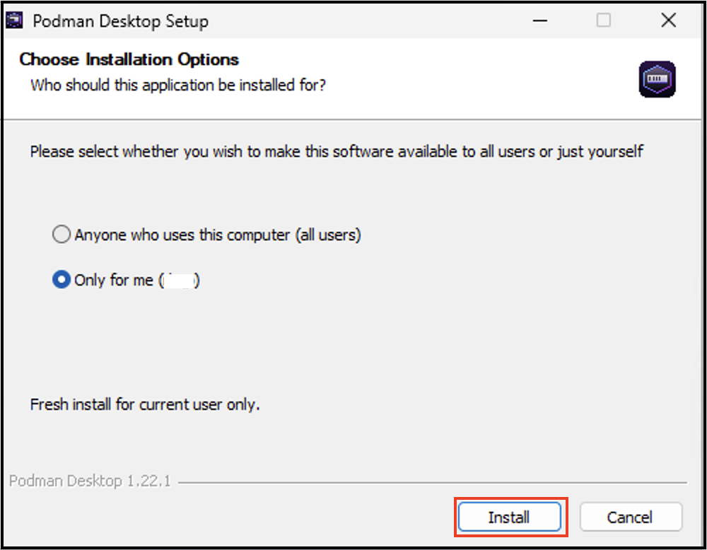

# Installing Podman Desktop and Podman on Windows

## Installing Podman Desktop

You can install Podman Desktop by using:

- The Windows installer
- Windows Package Manager (WinGet)
- Other alternative methods

_**Using the Windows installer**_

During setup, you can choose from the following installation scopes:

- Anyone who uses this computer (all users): Installs the application for all users and requires administrative privileges; enter your credentials when prompted.
- Only for me (Username): Installs the application for the current user only; no administrative privileges required.

#### Procedure

1. [Download the Windows installer](/downloads/windows).
1. Locate the file in the `Downloads` folder, and double-click it. The **Podman Desktop Setup** screen opens.
1. Select whether to install the application for all users or only for the current user.
1. Click **Install**.
   
1. After the installation is complete, click **Finish** to close the screen. The **Get started with Podman Desktop** screen opens.

_**Using WinGet**_

1. [Install the Winget Package manager for Windows](https://aka.ms/getwinget).

1. Install from the terminal:

   ```shell-session
   > winget install RedHat.Podman-Desktop
   ```

<details>
<summary>
Alternate installation methods:
- Silent Windows installer
- Chocolatey
- Scoop
</summary>

#### Silent Windows installer

1. [Download the Windows installer](/downloads/windows).

1. To install without user interaction, run the Windows installer with the silent flag `/S` from the Command Prompt:

   ```shell-session
   > podman-desktop-1.6.4-setup-x64.exe /S
   ```

#### Chocolatey

1. Install the [Chocolatey package manager](https://chocolatey.org/install).

1. Install from the terminal:

   ```shell-session
   > choco install podman-desktop
   ```

#### Scoop package manager for Windows

1. [Install the Scoop package manager](https://github.com/ScoopInstaller/Install#readme).

1. Install from the terminal:

   ```shell-session
   > scoop bucket add extras
   > scoop install podman-desktop
   ```

</details>

## Installing Podman

On Windows, running the Podman container engine requires a Linux distribution to run in a virtual machine. You can use Windows Subsystem for Linux version 2 (WSL 2) or Hyper-V as the machine provider.

During Podman installation, ensure that you have administrator privileges for the following tasks:

- Enable the WSL or Hyper-V feature.
- Create a Hyper-V Podman machine.

### Use WSL2 as machine provider

Podman Desktop creates a [Windows Subsystem for Linux version 2 (WSL 2)](https://learn.microsoft.com/en-us/windows/wsl/about#what-is-wsl-2) virtual machine, also known as the Podman machine. The major benefits are:

- Ease of use.
- WSL 2 native virtualization performance.

You must enable the WSL feature. This is required by Podman Desktop to create the default `wsl` Podman machine.

#### Prerequisites

Check that your environment meets the following requirements:

- 6 GB of RAM for the Podman machine.
- Required WSL 2 prerequisites:
  - Administrator privileges for the Windows user.
  - Windows 64bit.
  - All editions: Windows 10 Build 19043 or later, or Windows 11
  - Enable [nested virtualization](https://learn.microsoft.com/en-us/virtualization/hyper-v-on-windows/user-guide/nested-virtualization#configure-nested-virtualization) if you are running Windows as a VM on a host hypervisor.

#### Procedure

1. Run the following commands to enable the WSL feature without installing the default Ubuntu distribution of Linux:

   ```shell-session
   > wsl --update
   > wsl --install --no-distribution
   ```

   :::note

   If you run the Podman Desktop setup on a Windows 10 LTSC version, you require to install a specific WSL distribution. See [Troubleshooting Podman on Windows](/docs/troubleshooting/troubleshooting-podman-on-windows#windows-10-enterprise-ltsc-version-21h2-podman-desktop-is-unable-to-detect-wsl2-machine)

   :::

1. Restart your machine.
1. Run the `wsl --status` command in the CLI to check that WSL 2 is available.

### Use Hyper-V as machine provider

As an administrator, you can set up a Podman machine using Hyper-V as the provider. Hyper-V on Windows offers the following benefits:

- Run multiple operating systems on a single machine.
- Speed up virtual machine deployment.
- Enhance security through environment isolation.
- Simplify management using native Windows tools and PowerShell.

You must enable the Hyper-V feature. This is required by Podman Desktop to create the `Hyper-V` Podman machine.

#### Prerequisites

Check that your environment meets the following requirements:

- 6 GB of RAM for the Podman machine.
- Required Hyper-V prerequisites:
  - Administrator privileges for the Windows user.
  - Windows 64bit.
  - Pro or Enterprise edition: Windows 10 Build 19043 or later, or Windows 11
  - Enable [nested virtualization](https://learn.microsoft.com/en-us/virtualization/hyper-v-on-windows/user-guide/nested-virtualization#configure-nested-virtualization) if you are running Windows as a VM on a host hypervisor.

#### Procedure

1. Run the following command to enable the Hyper-V feature:

   **Using command prompt**

   ```shell-session
   > DISM /Online /Enable-Feature /All /FeatureName:Microsoft-Hyper-V
   ```

   **Using PowerShell**

   ```shell-session
   > Enable-WindowsOptionalFeature -Online -FeatureName Microsoft-Hyper-V -All
   ```

1. Restart your machine.

#### Verification

- Check that Hyper-V is active.

  **Using command prompt**

  ```shell-session
  > systeminfo
  ```

  **Using PowerShell**

  ```shell-session
  > Get-Service vmcompute
  ```

### Install Podman Desktop dependencies

When the Podman Desktop installation completes, the **Get started with Podman Desktop** screen opens. This screen helps you to start the onboarding process. Alternatively, you can completely skip this onboarding setup. You can always complete the setup later by using one of the following ways:

- Use the **Set up** button in the notification on the **Dashboard** page.
- Use the **Setup Podman** button on the Podman tile, located on the **Settings > Resources** page.

#### Procedure

1. On the **Get started with Podman Desktop** screen, click **Start Onboarding**.
1. Perform the following steps to install Podman:
   1. Click **Next**. A confirmation notification opens.
   1. Click **Yes**. The **Podman Setup** screen opens with the default WSLv2 virtualization provider selected.
   1. Optional: Select the **Windows Hyper-V** provider when needed.
   1. Click **Install**. A notification stating **Installation Successfully Completed** appears on the screen.
      
   1. Click **Close**. A page notifying that Podman is set up correctly opens.
1. Perform the following steps to create a Podman machine:
   1. Click **Next**. A page notifying you to create a Podman machine opens.
   1. Click **Next**, and then click **Create**.

1. Click **Next**, and follow the instructions on the screen to install the `kubectl` and `compose` CLIs.
1. After installing the CLIs, click **Next** to go to the **Dashboard** page.

#### Verification

- Go to the **Settings > Resources** page, and view the running Podman machine on the **Podman** tile.

You are ready to use the application.

#### Next steps

- [Work with containers](/docs/containers).
- [Work with Kubernetes](/docs/kubernetes).
