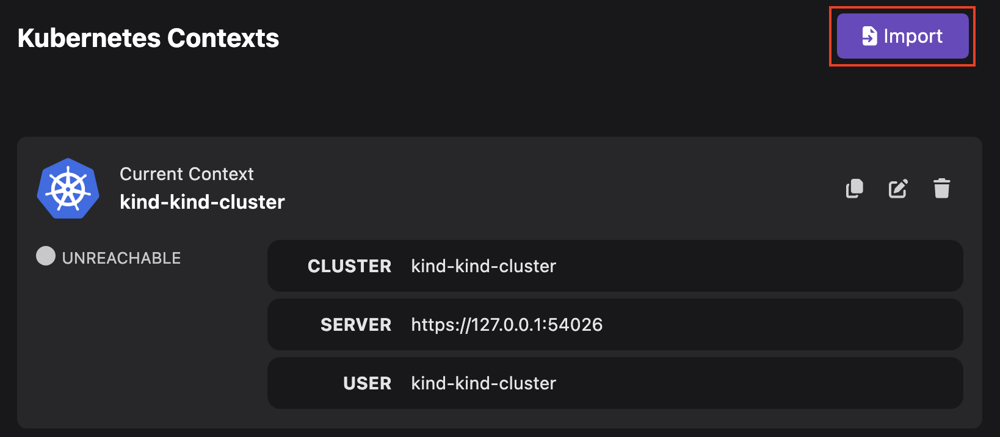
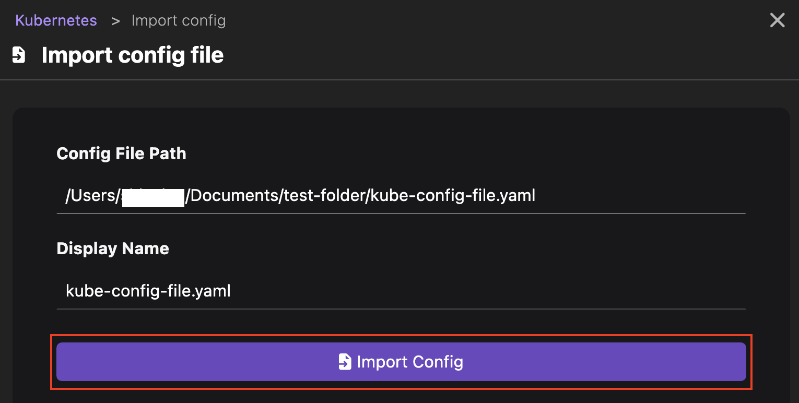
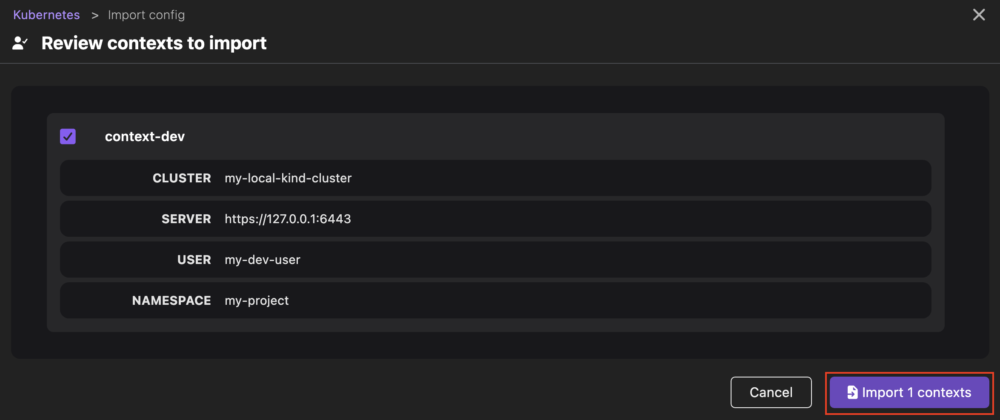

# Managing a Kubernetes context

Within Kubernetes, a context is useful to:

- Manage multiple development, testing, and production environments.
- Simplify your interaction when working with multiple clusters, users, and namespaces.

You can use the UI to edit or duplicate a context, or import a Kubernetes configuration file that contains multiple contexts. These tasks help in defining contexts with different configurations, enabling easy switching between environments during development.

#### Prerequisites

- [A running Podman machine](/docs/podman/creating-a-podman-machine).
- [A Kubernetes cluster](/docs/kubernetes/creating-a-kube-cluster).

#### Procedure: Edit a context

1. Go to the **Settings > Kubernetes** page.
1. Click the **Edit Context** icon. The Edit Context popup window opens.
   
1. Edit any of the following context details:
   - Name
   - Cluster
   - User
   - Namespace
     
1. Click **Save**.

#### Procedure: Duplicate a context

1. Go to the **Settings > Kubernetes** page.
1. Click the **Duplicate Context** icon.

#### Procedure: Import contexts

1. Go to **Settings > Kubernetes**, and click the **Import** button.
   
1. Perform one of the following steps:
   - Drag and drop a Kubernetes configuration file.
   - Click **Choose file**:
     1. select a Kubernetes configuration file from your machine.
     1. Edit the display name if needed.
     1. Click **Import Config**.
        
1. Review the contexts to import, and click **Import contexts**.
   

#### Verification

- _Edit a context_: View the updated context details on the same page.
  
- _Duplicate a context_: View the duplicated context on the same page.
- _Import contexts_: View the added Kubernetes contexts on the same page.

#### Additional resources

- [Viewing and selecting the current Kubernetes context](/docs/kubernetes/viewing-and-selecting-current-kubernetes-context)
